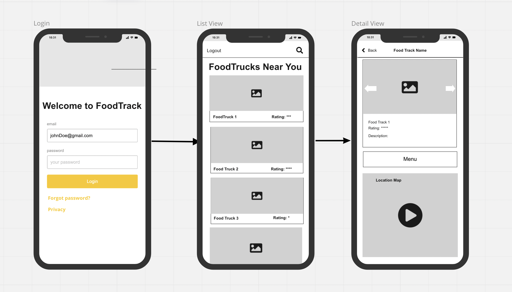
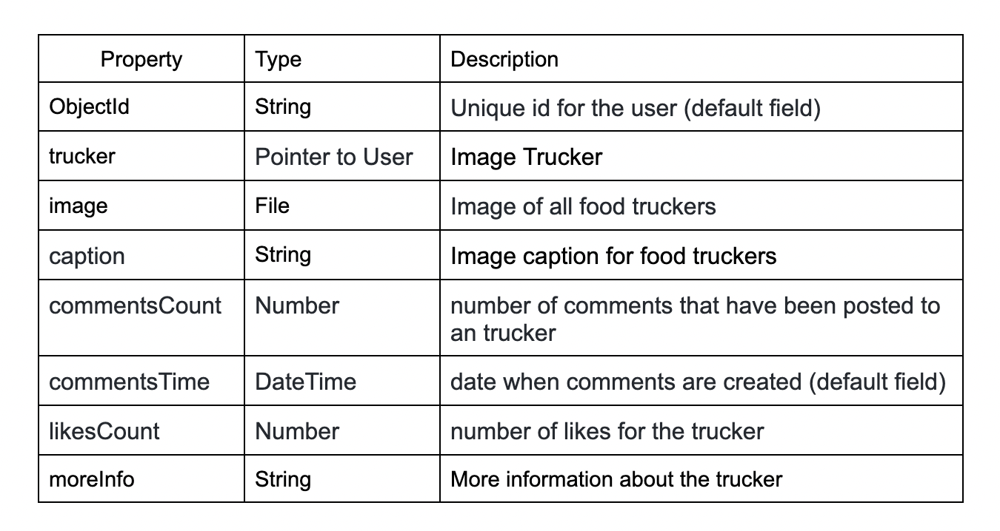

# Food Trucker Tracked  🌮 🍕 🥨

## Table of Contents
1. [Overview](#Overview)
1. [Product Spec](#Product-Spec)
1. [Wireframes](#Wireframes)
2. [Schema](#Schema)

## Overview
### Description
Food Trucker Tracked is your one-stop app for finding the best food trucks near you. Search for local food trucks by distance, cuisine, price range, and more!

### App Evaluation
[Evaluation of your app across the following attributes]
- **Category:** Food & Drink
- **Mobile:** App, mobile-first experience
- **Story:** Enabling users to find food trucks near them
- **Market:** Anyone who has a passion for food! Specifically, college students can find cheap eats and alternatives to their college dining halls.
- **Habit:** Anytime users are looking for food
- **Scope:** Searching up nearby food trucks and seeing their ratings, distance, and price range

## Product Spec

### 1. User Stories (Required and Optional)

**Required Must-have Stories**

- [X] Login screen where user can create a account and log in
- [ ] List of food trucks
- [ ] Rating, price, cuisine, address, name and image of each food truck
- [ ] Detail screen of each food truck

**Optional Nice-to-have Stories**

- [ ] Distance of food truck from user
- [ ] Favorite food trucks
- [ ] Map with directions of getting to food truck

### Current Progress GIF
Note: Please ignore how after login the screen shows movies (we are using Flix as a model for helping us with layout and connecting our food truck API)

### 2. Screen Archetypes

* Stream
   * Sending network requests to retrieve lists of content data to display
   * Creating a list of items based on that source data including displaying text and media
   * Handling cases where the user wants to view more information on a piece of content
* Detail
   * Sending network request to retrieve additional details or media for the data item
   * Action buttons that allow user to interact with the item

### 3. Navigation

**Tab Navigation** (Tab to Screen)

* Home Feed Screen
* Detail Screen

**Flow Navigation** (Screen to Screen)

* Home Feed
   * => Food Track Detail
* Detail Screen
   * => Home Feed (Back)

## Wireframes

### [BONUS] Digital Wireframes & Mockups

### [BONUS] Interactive Prototype

## Schema 
[This section will be completed in Unit 9]
### Models

### Networking
* Home Feed Screen
  * (Read/GET) Query 20 posts in Food Truck API
  * (Create/POST) Create a new like on a food truck post
  * (Delete) Delete existing like
* Detail Feed Screen
  * (Read/GET) Query information like price range and cuisine in Food Truck API
* Profile Screen
  * (Read/GET) Query logged in user object
  * (Update/PUT) Update user profile

- [Create basic snippets for each Parse network request]
- [OPTIONAL: List endpoints if using existing API such as Yelp]
